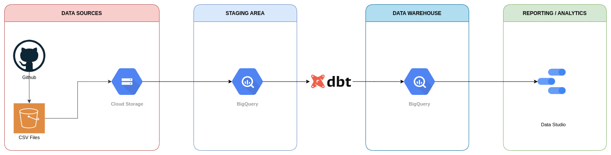

# Football Data Analytics

Final project data enginerring zoomcamp: https://github.com/DataTalksClub/data-engineering-zoomcamp

## Objective
Process files with football transfers data between 1999 and 2020.

## Sources
The origial repository with csv files: https://github.com/ewenme/transfers 

## Prerequisites
- Installed locally:
    - Python 3
    - Docker with docker-compose
- A project in Google Cloud Platform with a GCS Bucket and a warehouse in Bigquery.
- S3 bucket created in AWS. 

## Setup
1. From IAM in GCP (https://console.cloud.google.com/iam-admin/serviceaccounts) create a new service account, add a key associated to this account and download the credentials file, rename it to "google_credentials.json" and save the file in the root.
2. Run `$ cp .env.example .env` to create .env file
3. Set variables in .env file.
4. Create a python environment (ex: with Anaconda run `$ conda create --name myenv` and activate it with `$ conda activate myenv` ) 
5. Run `$ pip install -r requirements.txt`
6. Run `$ docker-compose up`
7. Run `$ prefect server create-tenant -n default`
8. Run `$ prefect create project ELT`
9. Run `$ python register_flows.py`
10. Run `$ prefect agent local start --label docker`

## Architecture diagram

## Technologies
* Amazon Web Services: S3 Storage 
* Google Cloud Platform (GCP): Cloud-based auto-scaling platform by Google
    * Google Cloud Storage (GCS): Data Lake
    * BigQuery: Data Warehouse
    * Data Studio: Analytics Visualization
* Docker: Containerization
* SQL: Data Analysis & Exploration
* Prefect: Pipeline Orchestration
* dbt: Data Transformation